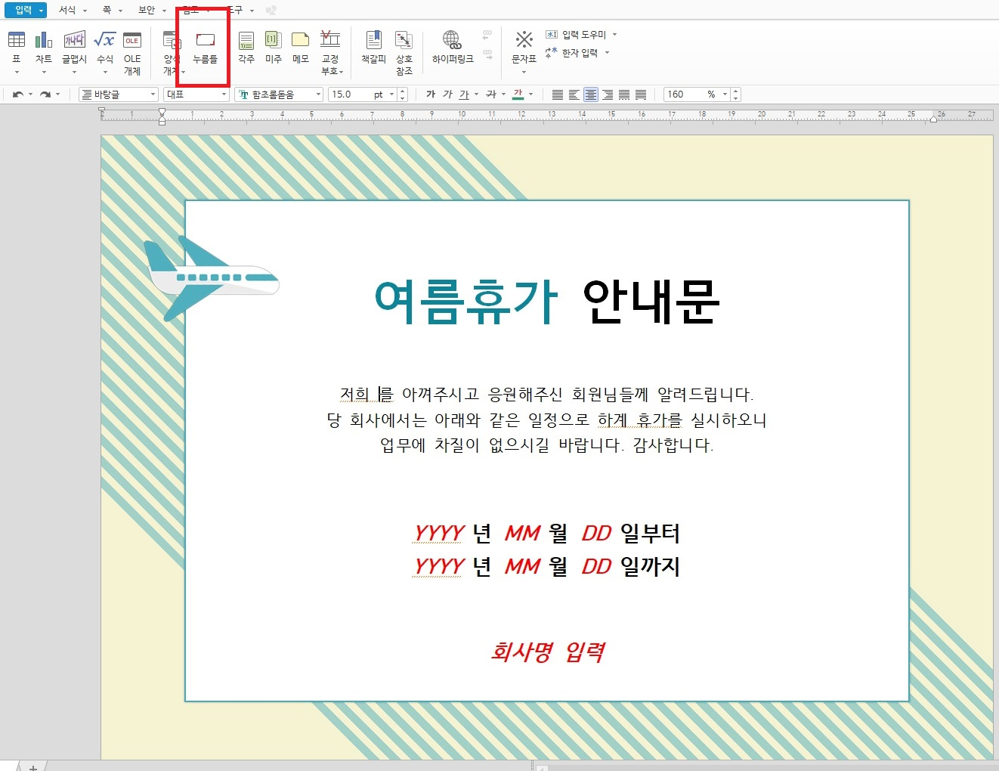
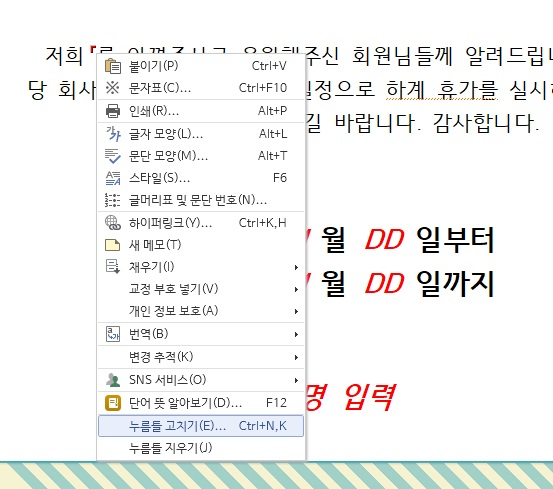
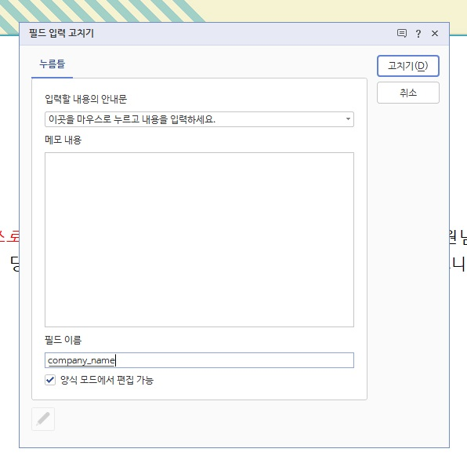
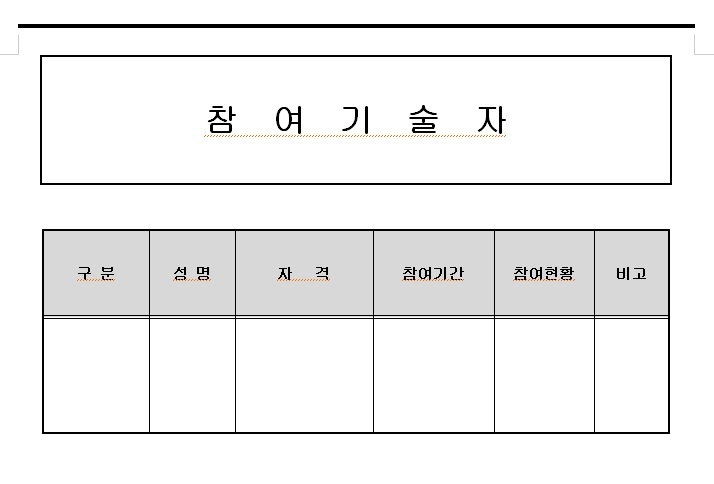
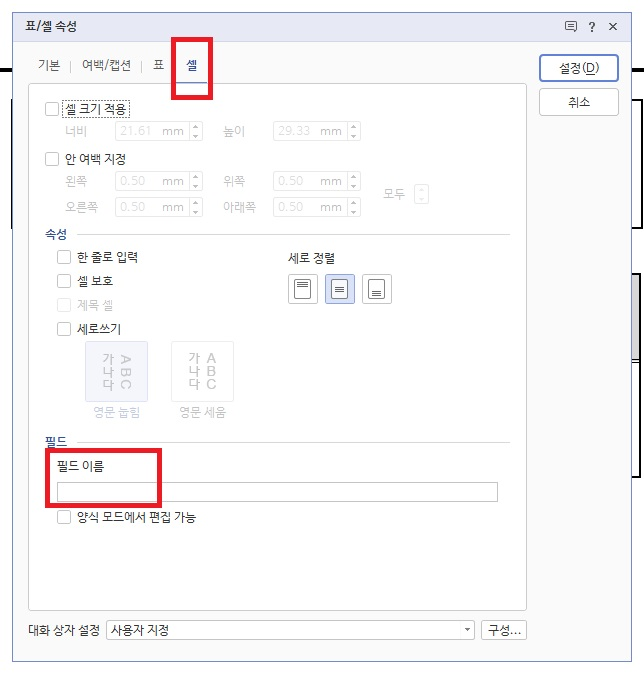

# PyHwp

##  Init

### 필요 패키지 설치 

아래 중 한개 선택

 - poetry
```
poetry install
```

 - 기본 pip 사용
```
pip install pydantic pywin32 PyYAML
```

 - requirements.txt 사용
```
pip install -r requirements.txt
```


### 설정: py_hwp.yaml

|분류|항목|내용|설명|
|---|---|---|---|
|system|genpy|gen_py가 들어있는 디렉터리를 입력|pywin32를 실행하면 생성되는 python cache이다. 이것을 방치하면 자꾸 오류가 나므로 프로그램 시작시 삭제하는 것을 추천한다. 통상 {사용자폴더}\AppData\Local\Temp 에서 찾을 수 있다.|
|system|filepath_checker_module|registry에 등록해둔 한글보안모듈 문자열명을 기록한다.|pywin32를 이용해서 한글을 조작하면 보안메시지가 뜨면서 수동으로 "예"를 클릭해야 진행되는 문제가 있는데, 그 보안메시지 팝업을 제거해주는 모듈이다. registry에 등록하는 선 작업을 거쳐야 하며 이 작업에 대해서는 후술한다.|
|file|directory|한글 템플릿 문서 위치|작업할 템플릿 문서가 위치할 디렉토리|
|file|output_directory|완성될 한글 문서 위치|완료된 한글 문서를 놓을 디렉토리|
|image|defaut_width|삽입 이미지 기본 너비|이미지 삽입시 디폴트 사이즈를 입력하는 곳|
|image|default_height|삽입 이미지 기본 높이|이미지 삽입시 디폴트 사이즈를 입력하는 곳|


### 보안 모듈 FilePathCheckerModule

파이썬으로 한글을 작동시키면, 한글 어플리케이션은 비정상적인 명령이 들어온다고 생각하여 맞는지 확인을 하는 팝업을 띄운다. "예"를 누르면 정상적으로 동작하긴 하지만, 작업을 할때마다 "예"를 눌러서는 자동화를 하는 보람이 없으므로, 이 팝업을 띄우지 않게 해야 한다.

방법은 다음과 같다. 
1. regedit를 연다
2. ```HKEY_CURRENT_USER\Software\HNC\HwpAutomation\Modules```폴더로 이동(만약 이 폴더가 없다면 아래아한글이 버전이 맞지 않는 것이다.)
3. 새로만들기 > 문자열값 을 선택
4. 값이름은 임의로 정한다(다른 이름과 겹치지 않게 복잡한 이름을 할 것을 추천. 못정하겠으면 그냥 HwpSecurityPassModule로 해도 됨).
5. 값데이터에는 etc폴더 내의 HwpSecurityPassModule.dll의 절대경로(파일명 포함)를 입력한다.
6. 4번의 값이름을 py_hwp.yaml에 등록한다.
7. 실행시 정상적으로 팝업창이 뜨지 않고 잘 실행되는지 확인한다.


## Basic Usage

### pythoncom과 threading

```
from threading import Thread
import pythoncom

class SubThreading(Thread):
    def __init__(self,):
        super().__init__()

    def run(self):
        pythoncom.CoInitialize()

        # 여기에 코드 작성

        pythoncom.CoUninitialize()

sub_thread = SubThreading()
sub_thread.start() # 생성한 thread 시작
sub_thread.join() # 생성한 thread 종료시까지 대기
```

안정적인 python 한글을 사용하기 위해서는 sub thread를 새로 하나 파서 작업 하는 것을 권장한다.
코드를 작성할 때에는 위에 적힌 코드의 ```pythoncom.CoInitialize()``` 과 ```pythoncom.CoUninitialize()``` 사이에 코드를 작성하도록 하자.

### 인스턴스 생성

```python
pyhwp = PyHwp(filename, visible)
```

|parameter|description|note|
|---|---|---|
|filename|파일 위치는 yaml파일에 설정해 두었으니, 파일 명만 입력한다.|str|
|visible|True면 한글 작업이 모든 과정이 보일 것이고, False로 하면 백그라운드에서 동작한다.|bool값이며 입력 안해도 됨. 미입력시 False가 default|

인스턴스만 생성될 뿐 아무런 변화도 일어나지 않는다. 본격적으로 한글 문서 작업을 하기 전에 반드시 한글 문서를 "여는" 작업을 해야 한다.


### 한글 문서 열기

```python
pyhwp.openhwp()
```

이 작업 이후에 이하의 모든 작업을 개시 할 수 있다.


### 한글 문서 닫기

위의 한글 문서 열기가 필수인 만큼이나, 마찬가지로 문서 작업이 종료 되었으면 반드시 닫기를 하여야 한다. 그렇지 않으면 백그라운드에서 계속해서 한글 문서가 열려 있게 되면 모든 오류의 근원이 된다.

닫기는 두 종류가 있다. 저장하고 닫기와 그냥 닫기.

 - 그냥 닫기
```python
pyhwp.quit_without_save()
```
별로 쓸 일은 없을듯

 - 저장하고 닫기
```python
pyhwp.save_and_quit(filename)
```

|parameter|description|note|
|---|---|---|
|filename|파일이 저장될 위치는 yaml파일에 설정해 두었으니, 파일 명만 입력한다. 필수가 아닌 optional이며 미입력시 열었던 한글 명 그대로 저장된다.|str, optional|


### 문자열 입력하기

 - 개요
```python
pyhwp.str_to_field(dict)
```

딕셔너리[str, str]를 파라미터로 입력하면 key위치에 value가 들어가는 식으로 동작한다.

 - 누름틀

아래아한글에는 누름틀 이라는 것이 있는데, 상단 입력탭에 누름틀 이라는 것이 있다. 필드라고도 하며, 이것을 생성하고 우클릭하여 누름틀 고치기(ctrl+n,k)를 누르면 하단에 필드 이름을 정할 수 있다.

여기서 중요한 것이 필드이름인데, dictionary의 key를 입력해 두면 이 자리에 value가 들어가는 방식이다.
자세한 설명은 이하를 참고.

   
입력탭에 누름틀이 있다. 커서를 원하는 곳에 놓고 누름틀을 누르게 되면   

   
위처럼 빨간 문구로 누름틀이 생성된다. 저 빨간 문구는 편집시에만 보이며 출력하면 보이지 않는다.   

   
누름틀을 클릭하여 커서를 놓고 다시 우클릭을 하면 누름틀 고치기 라는 메뉴가 생기는데, 이를 클릭하면   

   
편집시에 보일 문구(입력할 내용의 안내문)와 필드이름을 정할 수 있다. 가급적 입력할 내용의 안내문은 삭제하도록 하고(보기에 엄청 지저분함) 필드이름이 중요한데,
필드이름을 company_name이라고 했다고 가정하면, {"company_name": "새라아이씨티"} 라고 한 딕셔너리를 입력하면 저 위치에 "새라아이씨티"라는 문구가 들어가게 된다.   

 - 예제

```python
from py_hwp import PyHwp
from threading import Thread
import pythoncom

class SubThreading(Thread):
    def __init__(self,):
        super().__init__()

    def run(self):
        pythoncom.CoInitialize()

        # 여기에 코드 작성
        pyhwp = PyHwp("여름휴가 안내문.hwp", True)
        pyhwp.openhwp()

        data: dict = {}
        data["company_name"] = "새라아이씨티"

        pyhwp.str_to_field(data)
        pyhwp.save_and_quit("여름휴가 안내문2.hwp")

        pythoncom.CoUninitialize()

sub_thread = SubThreading()
sub_thread.start()
sub_thread.join()
```


### 이미지 입력하기

- 개요
```python
pyhwp.image_to_field(fieldname, image_full_path, width, height)
```

누름틀일 이용한다는 점에서 문자열 입력과 원리는 같다.

누름틀을 이미지를 넣을 자리에 생성해 두고 누름틀 이름을 지정한다.
그 누름틀명을 첫번째 path으로 넣고, 이미지의 path를 두번째 param로 넣게 되면 

|parameter|description|note|
|---|---|---|
|fieldname|필드명(누름틀명). 이미지가 들어갈 자리에 미리 입력해둔 누름틀의 이름|str|
|image_full_path|이미지가 있는 위치|str(PathLike)|
|width|이미지의 너비(밀리미터-한글 상단, 좌측에 있는 자로 측정 가능)|int|
|height|이미지의 높이(밀리미터-한글 상단, 좌측에 있는 자로 측정 가능)|int|

> 주의: 한글 파이썬에서 모든 경로는 가급적 절대경로로 써야 함.


- 예제
```python
from py_hwp import PyHwp
from threading import Thread
import pythoncom
from util import abs_path

class SubThreading(Thread):
    def __init__(self,):
        super().__init__()

    def run(self):
        pythoncom.CoInitialize()

        pyhwp = PyHwp("여름휴가 안내문.hwp", True)
        pyhwp.openhwp()

        image_file_path = abs_path(r".\etc\logo.png")

        pyhwp.image_to_field("company_logo", image_file_path, 82, 22)
        pyhwp.save_and_quit("여름휴가 안내문(3).hwp")

        pythoncom.CoUninitialize()

sub_thread = SubThreading()
sub_thread.start()
sub_thread.join()
```


### 테이블 입력하기

- 개요
```python
pyhwp.table_maker_list2d(start_field, list2d, new_row, pass_first_col)
```

2차원 배열을 입력하여 테이블을 생성하는 방식이다.
new_row를 True로 하게 되면 아래로 표를 써 내려가면서 새로 행을 생성한다. 이미 빈 표가 사이즈가 맞게 생성되어 있고 값만 채울 경우에는 new_row를 False로 하면 된다.

|parameter|description|note|
|---|---|---|
|start_field|필드명(누름틀명). 표가 들어갈 자리에 미리 입력해둔 누름틀의 이름|str|
|list2d|표로 입력할 2차원 배열|list[list[str]]|
|new_row|이미지의 너비(밀리미터-한글 상단, 좌측에 있는 자로 측정 가능)|bool|
|pass_first_col|이미지의 높이(밀리미터-한글 상단, 좌측에 있는 자로 측정 가능)|bool|


- 셀 누름틀

누름틀은 위에서 설명한 대로 생성해도 되지만, 표의 경우에는 특수하게 셀에 누름틀 명을 설정할 수 있다.   

   

표에서 원하는 셀에 커서를 놓고 ctrl+n,k를 누르면   

   

이처럼 표/셀 속성이 뜨는데 여기서 셀탭으로 들어가면 필드 이름을 설정할 수 있다.

 > 이 필드이름은 위의 문자열 누름틀때와 동일하게 작용하므로, 표에 값을 채워넣기 위해 이처럼 표에 누름틀 명을 지정해놓고 str_to_field를 사용해도 된다.
 > 반대로 말하면, str_to_field에 셀 필드명도 조회 되므로 테이블 생성을 위한 시작점 필드명은 반드시 unique해야 한다. 이미지의 경우도 마찬가지


 - 예제

```python
from py_hwp import PyHwp
from threading import Thread
import pythoncom

class SubThreading(Thread):
    def __init__(self,):
        super().__init__()

    def run(self):
        pythoncom.CoInitialize()

        pyhwp = PyHwp("자격 및 기술진.hwp", True)
        pyhwp.openhwp()

        data_table = [
            ["책임기술자", "홍길동", "특급기술자", "2024.01.31\r\n~\r\n2024.02.03", "보고서 검토 및 현장책임", "-"],
            ["참여기술자", "임꺽정", "중급기술자", "2024.01.31\r\n~\r\n2024.02.03", "보고서 작성 및 현장조사", "-"],
            ["참여기술자", "일지매", "초급기술자", "2024.01.31\r\n~\r\n2024.02.03", "보고서 작성 및 현장조사", "-"]
        ]

        pyhwp.table_maker_list2d("table_01", data_table, True)
        pyhwp.save_and_quit("자격 및 기술진(2).hwp")

        pythoncom.CoUninitialize()

sub_thread = SubThreading()
sub_thread.start()
sub_thread.join()
```

> 이상의 예에서 보듯이 한글에서 줄바꿈은 ```\n``` 이 아니라 ```\r\n``` 임을 기억한다.

