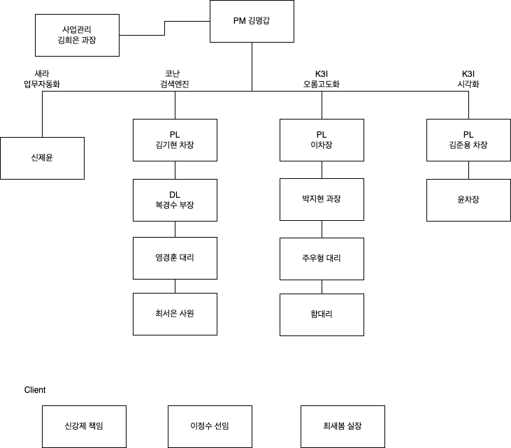
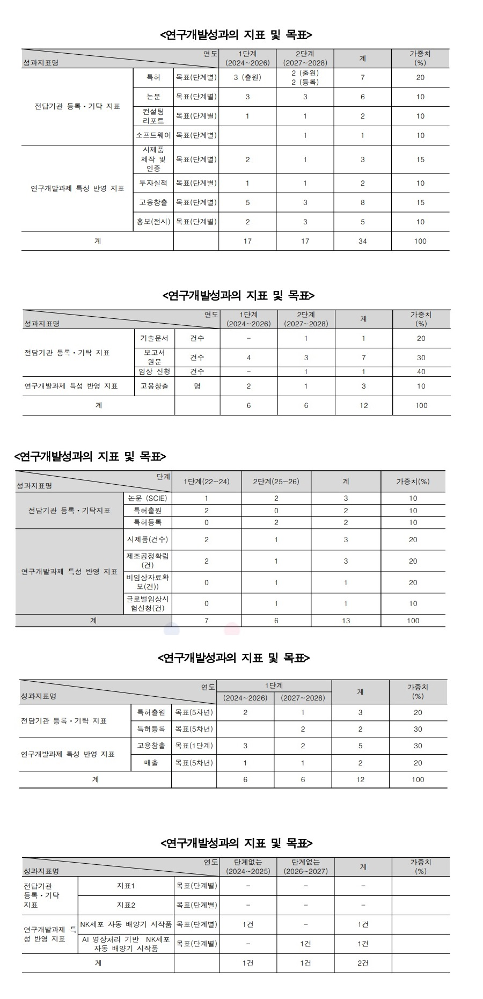
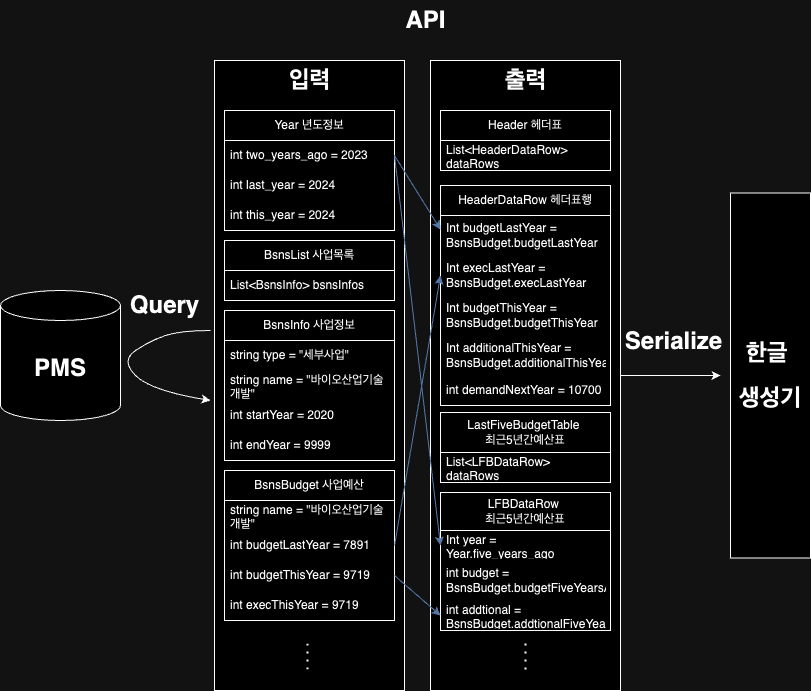

# 산업기술평가관리원 : 업무자동화 프로젝트(문서자동화, PDF추출)

## 업무환경

- 산기평 위치 : 대전 서구 둔산중로 50 11층

- 내부망 체크리스트 : email, Hiware, PMS 연결(DB safer, jdbc plugin), svn, edms, 장비(새라에서 도입한) 방화벽 해제 등

- 외부망 체크리스트 : email, 파일전송 시스템

- 조직도

## PMS 분석

- 스펙 : Oracle

- 접속방법 : DB safer 접속(이름, 입원서류에 적어서 낸 비번), DBeaver에 jdbc 플러그인 설치(전부 Hiware에 있음), 잘 모르겠으면 담당자(보통은 이차장)에게 문의

- 명칭

|명칭|내용|
|---|---|
|bsns|사업(세부사업, 내역사업)|
|sbjt|과제|
|comm_cd|공통코드 집합|
|bud|budget(예산)|
|exec|집행|
|amt|amout(양, 금액)|

## 보고서 

샘플 참고

## PDF

- 샘플

- 작업순서

    1. 작업대상 판별:    
    PMS에서 특정 년도에 해당하는 과제 > 에 해당하는 문서 목록 중 > 특정 코드 문서 > 에 매핑된 edms 아이디 찾기

    2. edms 에서 다운로드:   
    edms api 에 edms_id 등 4종 정보 입력 하면 해당 문서 다운로드 됨

    3. 다운로드 된 문서(PDF 또는 한글) 전처리:   
    <연구개발성과의 지표 및 목표> 가 있는 페이지를 찾아 그 페이지만 자르기 > PDF는 한글로 변환

    4. 한글로 변환된 페이지에서 데이터 추출

## 구조도(문서자동화)

1. PMS에서 추출해야할 값 들을 분류하여 object로 만든다 (입력object)

2. 보고서 상에 표현하여야 할 표(또는 텍스트)를 object 로 만든다 (출력object) 약 20개

3. 입력 object의 값들을 이용하여 출력 object의 값들을 채운다

4. 출력 object를 직렬화 하여 한글 생성기로 전송한다.

